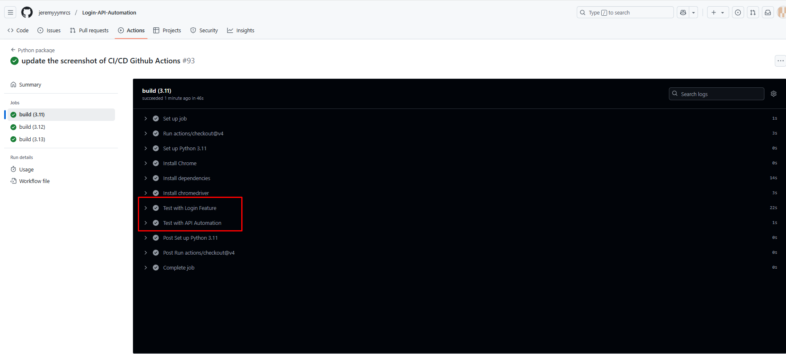
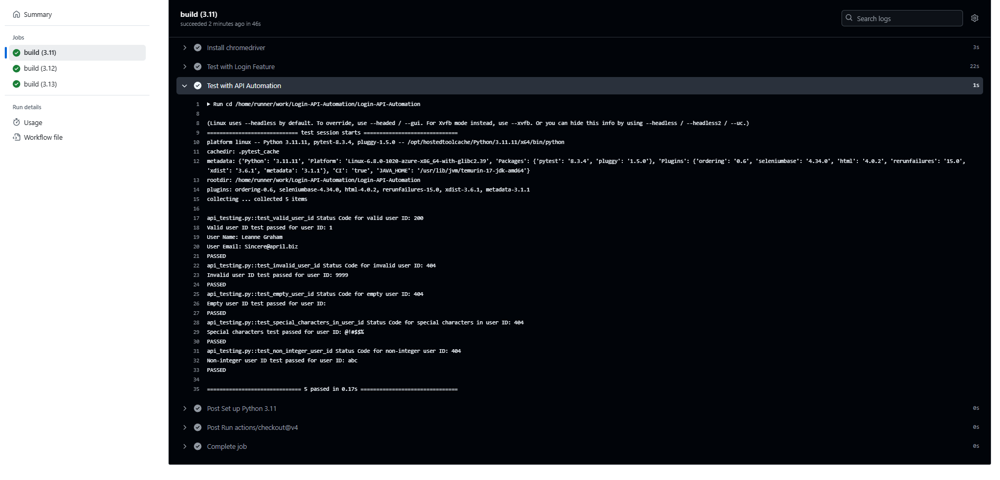

## Running Login Test

1. **Clone the repository**:

```bash
git clone repository_url
```

2. **Open your command-line interface (e.g., Command Prompt or Terminal). Navigate to the project directory using the cd
   command**:

```bash
cd path/to/ProjectDirectory
```

3. **Create a Virtual Environment**:

```bash
python -m venv venv
```

4. **Activate the Virtual Environment**:

```bash
venv\Scripts\activate
```

5. **Install the required Python packages from the requirements.txt file using pip**:

```bash
pip install -r requirements.txt
```

## Running the login test

*Once you’ve installed the dependencies, you can run the automated tests with Pytest.*:

```bash
cd tests
pytest test_login.py -s -q -x --dashboard --html=report.html --maximize --screenshot --rs
```

*Run the tests in demo mode (optional):*

```bash
pytest test_login.py -s -q -x --dashboard --html=report.html --maximize --screenshot --rs --demo
```

## Running the API Tests

Once you’ve installed the dependencies, you can run the automated tests with Pytest:

```bash
cd ..
pytest api_testing.py -s -v
```

## GitHub Actions CI/CD

This repository includes pre-configured **GitHub Actions** workflows to automatically run the tests in a continuous
integration/continuous deployment (CI/CD) pipeline.

The workflow will run the tests on every push to the repository and generate a report upon completion. Here’s what it
includes:

- **Test execution on each commit**: Every push to the repository triggers the workflow to run tests.
- **Automated HTML report generation**: After each test run, an HTML report is generated, which includes detailed test
  results and screenshots in case of failure.
- **Notifications and logging**: The results are logged in GitHub Actions with notifications for success or failure.
- **Environment setup**: The GitHub Action automatically sets up the necessary Python environment, installs
  dependencies, and executes the tests.

You can find the GitHub Actions workflow file in the `.github/workflows/` directory.






